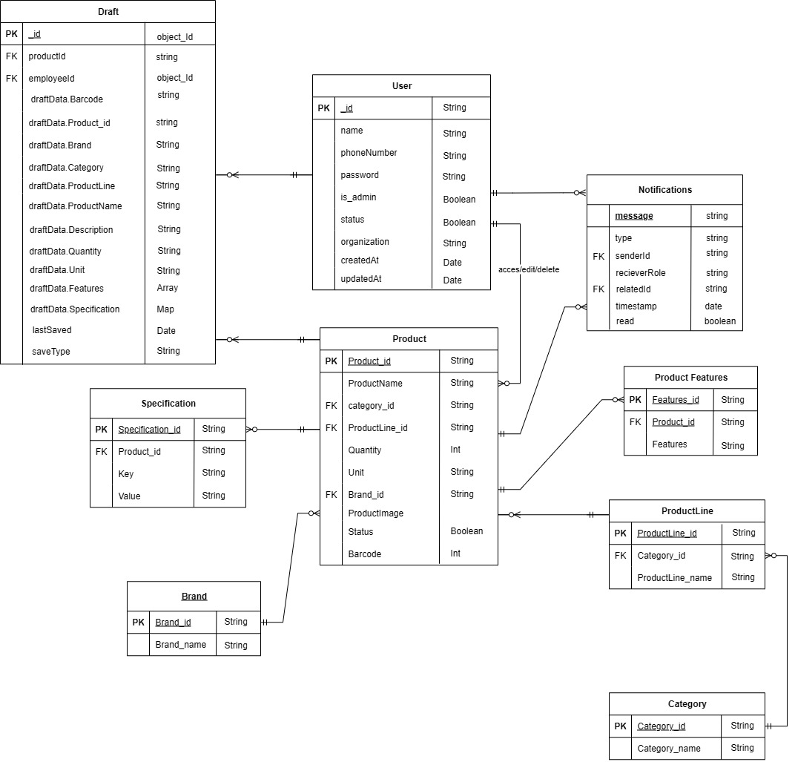
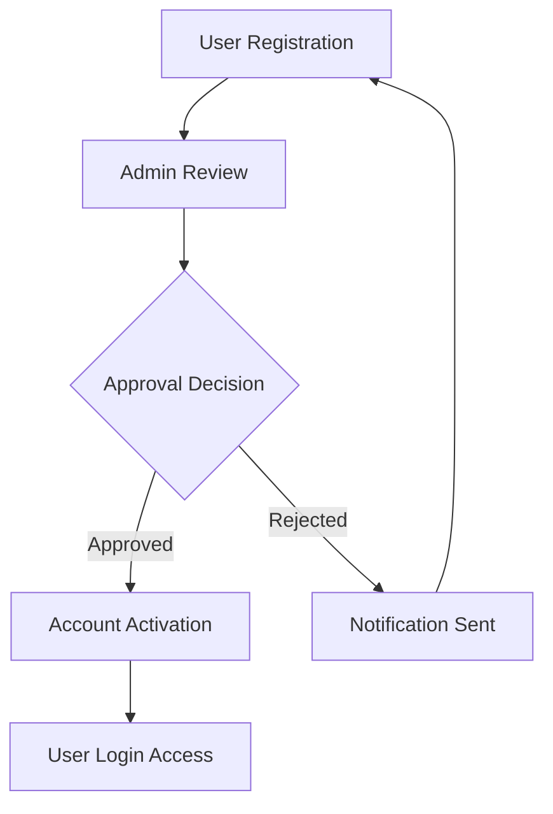
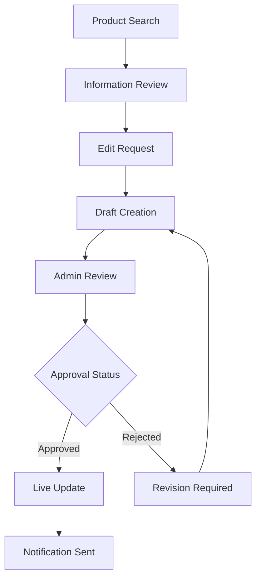

# Product Details Management System

<div align="center">


**Enterprise-Grade Supermarket Product Management Platform**

*Empowering retail operations through intelligent product information management, streamlined workflows, and AI-enhanced barcode processing.*

---

[**Key Features**](#key-features) • [**Architecture**](#system-architecture) • [**Database Design**](#database-design) • [**Quick Start**](#quick-start) • [**API Documentation**](#api-documentation) 

</div>

## Overview

The Product Details Management System is a comprehensive enterprise solution designed to revolutionize supermarket operations through intelligent product information management. Built with modern technologies and industry best practices, this platform delivers seamless barcode processing, robust workflow management, and role-based access control to ensure operational excellence and data integrity.

### Business Value Proposition

- **Operational Efficiency**: Reduce product lookup time by 80% through AI-powered barcode processing
- **Data Integrity**: Maintain 99.9% accuracy through structured approval workflows
- **Scalable Architecture**: Support enterprise-scale operations with MongoDB and cloud-ready infrastructure
- **Enhanced User Experience**: Intuitive interfaces designed for both technical and non-technical staff

## Key Features

### 🔐 Enterprise Authentication & Authorization
- **Multi-tier Role Management**: Granular permissions for Administrators and Employees
- **JWT-based Security**: Industry-standard token authentication with refresh capabilities
- **Approval-based Registration**: Controlled user onboarding with administrative oversight
- **Session Management**: Secure, persistent user sessions with automatic timeout

### 📦 Advanced Product Management
- **Intelligent Barcode Processing**: AI-enhanced product identification with Google Gemini integration
- **Bulk Operations**: Process multiple barcodes simultaneously for enhanced productivity
- **Comprehensive Product Profiles**: Rich product information including specifications, features, and imagery
- **Hierarchical Organization**: Structured categorization through product lines and categories

### 🔄 Sophisticated Workflow Engine
- **Draft Management System**: Save work-in-progress with version control capabilities
- **Multi-stage Approval Process**: Ensure data quality through structured review workflows
- **Real-time Notifications**: Instant alerts for pending approvals and system updates
- **Audit Trail**: Complete change tracking and accountability measures

### 🛡️ Administrative Control Center
- **Approval Dashboard**: Streamlined interface for reviewing and approving changes
- **User Verification Portal**: Comprehensive user management and verification system
- **Data Recovery Tools**: Advanced trash management with restoration capabilities
- **System Configuration**: Centralized management of categories, brands, and product lines

### 👤 Employee Productivity Tools
- **Intuitive Search Interface**: Multi-parameter search with barcode, category, and text filters
- **Draft Workspace**: Collaborative editing environment with save and resume functionality
- **Submission Tracking**: Real-time status updates on approval requests
- **Mobile-Responsive Design**: Seamless experience across desktop, tablet, and mobile devices

## System Architecture

### Architectural Philosophy

Our system follows a modern, scalable three-tier architecture designed for enterprise reliability and performance:

```
┌─────────────────┐    ┌─────────────────┐    ┌─────────────────┐
│   Presentation  │    │   Application   │    │      Data       │
│      Layer      │◄──►│      Layer      │◄──►│     Layer       │
│                 │    │                 │    │                 │
│ • React SPA     │    │ • Express.js    │    │ • MongoDB       │
│ • Context API   │    │ • JWT Auth      │    │ • GridFS        │
│ • React Router  │    │ • Python AI     │    │ • Mongoose ODM  │
└─────────────────┘    └─────────────────┘    └─────────────────┘
```

### Technology Stack

#### Backend Infrastructure
- **Runtime Environment**: Node.js 18+ with Express.js framework
- **Database**: MongoDB with Mongoose ODM for flexible document storage
- **Authentication**: JWT with refresh token rotation
- **AI Integration**: Python microservices with Google Gemini API
- **API Design**: RESTful architecture with OpenAPI 3.0 specification

#### Frontend Application
- **Framework**: React 18 with modern hooks and context patterns
- **State Management**: React Context API with custom providers
- **Routing**: React Router v6 with protected route guards
- **Styling**: CSS3 with responsive design principles
- **Build System**: Create React App with custom webpack configuration

#### Integration Layer
- **AI Processing**: Python 3.8+ with specialized barcode processing libraries
- **External APIs**: Google Gemini for enhanced product information
- **File Storage**: GridFS for binary asset management
- **Logging**: Structured logging with configurable levels

## Database Design

Our data model emphasizes flexibility, scalability, and referential integrity with a comprehensive entity-relationship structure:

### Entity Relationship Diagram

<div align="center">



</div>

### Core Entities

The database architecture consists of interconnected entities that ensure data integrity and support complex business workflows:

**Primary Entities:**
- **Product**: Central entity containing comprehensive product information with relationships to categories, brands, and product lines
- **Category & ProductLine**: Hierarchical product organization enabling flexible categorization
- **Brand**: Manufacturer and brand information management with product associations
- **Admin & Employee**: Role-based user management with distinct permissions and capabilities
- **Specification & Features**: Extensible product attribute system for detailed product descriptions

**Relationships:**
- **One-to-Many**: Categories to Products, Brands to Products, ProductLines to Products
- **Many-to-Many**: Products to Features through junction relationships
- **Foreign Keys**: Ensuring referential integrity across all entity relationships

### Data Integrity Features

- **Referential Integrity**: Foreign key constraints maintain data consistency
- **Indexing Strategy**: Optimized indexes on frequently queried fields (barcodes, product names, categories)
- **Validation Rules**: Schema-level validation for data quality assurance
- **Audit Capabilities**: Built-in tracking for data changes and user actions

## Quick Start

### System Requirements

| Component | Minimum Version | Recommended |
|-----------|----------------|-------------|
| Node.js | 18.0.0 | 20.0.0+ |
| Python | 3.8.0 | 3.11+ |
| MongoDB | 5.0.0 | 7.0+ |
| npm | 8.0.0 | 10.0+ |
| Memory | 4GB RAM | 8GB+ RAM |
| Storage | 20GB | 100GB+ |

### Installation Process

#### 1. Repository Setup
```bash
git clone https://github.com/shanavasvb/product-details-application.git
cd product-details-application
```

#### 2. Backend Configuration
```bash
cd backend

# Install Node.js dependencies
npm install

# Configure Python environment
python -m venv barcode_env
source barcode_env/bin/activate  # Windows: barcode_env\Scripts\activate
pip install -r requirements.txt
```

#### 3. Frontend Setup
```bash
cd ../frontend
npm install
```

#### 4. Database Initialization
```bash
# Start MongoDB service
mongod --dbpath=/path/to/your/data/directory

# Optional: Initialize with sample data
npm run seed:database
```

### Environment Configuration

#### Backend Environment (.env)
```bash
# Server Configuration
NODE_ENV=production
PORT=5000
HOST=0.0.0.0

# Database Configuration
MONGODB_URI=mongodb://localhost:27017/product_details_db
MONGODB_OPTIONS={"useNewUrlParser":true,"useUnifiedTopology":true}

# Security Configuration
JWT_SECRET=your-256-bit-secret-key
JWT_EXPIRES_IN=24h
JWT_REFRESH_EXPIRES_IN=7d
BCRYPT_SALT_ROUNDS=12

# AI Integration
GEMINI_API_KEY=your-google-gemini-api-key
PYTHON_SCRIPT_PATH=./utils/barcode_api_processor.py
PYTHON_ENV_PATH=./barcode_env/bin/python

# Performance Configuration
API_TIMEOUT=30000
MAX_BARCODES_PER_REQUEST=50
RATE_LIMIT_WINDOW_MS=900000
RATE_LIMIT_MAX_REQUESTS=100

# Logging Configuration
LOG_LEVEL=info
LOG_FILE_PATH=./logs/application.log
```

#### Frontend Environment (.env)
```bash
# API Configuration
REACT_APP_API_URL=http://localhost:5000/api/v1
REACT_APP_API_TIMEOUT=30000
REACT_APP_API_RETRY_ATTEMPTS=3

# Application Configuration
REACT_APP_ENV=production
REACT_APP_VERSION=1.0.0
REACT_APP_ITEMS_PER_PAGE=20
REACT_APP_MAX_FILE_SIZE=10485760

# Feature Flags
REACT_APP_ENABLE_BARCODE_SCANNER=true
REACT_APP_ENABLE_BULK_OPERATIONS=true
REACT_APP_ENABLE_DARK_MODE=true

# Build Configuration
GENERATE_SOURCEMAP=false
INLINE_RUNTIME_CHUNK=false
```

## Deployment

### Production Startup

#### 1. Backend Services
```bash
cd backend
source barcode_env/bin/activate
npm run start:prod
```

#### 2. Frontend Application
```bash
cd frontend
npm start
```

### Application Access Points

| Service | URL | Description |
|---------|-----|-------------|
| Frontend Application | `http://localhost:3000` | Main user interface |


### Default Administrative Access

```
Phone Number: 1234567890
Password: admin123
```

## Business Workflows

### User Onboarding Process



### Product Management Lifecycle



## API Documentation

### Comprehensive API Reference

Our RESTful API follows OpenAPI 3.0 specifications with comprehensive documentation available at:

**📘 [Interactive API Documentation](https://app.swaggerhub.com/apis-docs/datcarts-01f/Supermarket-api/1.0.0)**

### Core API Endpoints

| Endpoint Category | Base Path | Description |
|-------------------|-----------|-------------|
| Authentication | `/api/v1/auth` | User authentication and authorization |
| Product Management | `/api/v1/product` | Product CRUD operations |
| Category Management | `/api/v1/category` | Product categorization |
| Brand Management | `/api/v1/brand` | Brand information management |
| Draft System | `/api/v1/draft` | Draft creation and management |
| Notification System | `/api/v1/notifications` | Real-time notifications |
| Administrative | `/api/v1/admin` | Admin-specific operations |

### Sample API Usage

```javascript
// Authentication Example
const response = await fetch('/api/v1/auth/login', {
  method: 'POST',
  headers: {
    'Content-Type': 'application/json'
  },
  body: JSON.stringify({
    phoneNumber: '1234567890',
    password: 'secure_password'
  })
});

// Product Search Example
const products = await fetch('/api/v1/product/search', {
  method: 'POST',
  headers: {
    'Authorization': `Bearer ${token}`,
    'Content-Type': 'application/json'
  },
  body: JSON.stringify({
    barcodes: ['123456789012', '987654321098']
  })
});
```

## Screenshots

<div align="center">

### Admin Dashboard
*Comprehensive administrative control panel for system management*

### Employee Interface
*Intuitive product search and management interface*

### Product Details View
*Detailed product information with specifications and features*

</div>

## Contributing

We welcome contributions to the Product Details Management System! Please follow these guidelines:

### Development Guidelines
- Follow the established code style and conventions
- Write comprehensive tests for new features
- Update documentation for any API changes
- Ensure all tests pass before submitting pull requests

### Reporting Issues
- Use the GitHub Issues template
- Provide detailed reproduction steps
- Include environment information
- Attach relevant logs or screenshots

## Development Team

**Project Maintainers:**
- [shanavasvb](https://github.com/shanavasvb)
- [AayishaOS](https://github.com/AayishaOS) 
- [SumayyaVN9](https://github.com/SumayyaVN9) 

## License

This project is proprietary software owned by Datcarts . All rights reserved.

## Support

- **Issues**: [GitHub Issues](https://github.com/shanavasvb/product-details-application/issues)
- **Documentation**: [API Documentation](https://app.swaggerhub.com/apis-docs/datcarts-01f/Supermarket-api/1.0.0)

---

<div align="center">

**© 2025 Datcarts Technologies. All Rights Reserved.**

[](https://github.com/shanavasvb/product-details-application)
[](https://app.swaggerhub.com/apis-docs/datcarts-01f/Supermarket-api/1.0.0)
[](https://github.com/shanavasvb/product-details-application/releases)


</div>